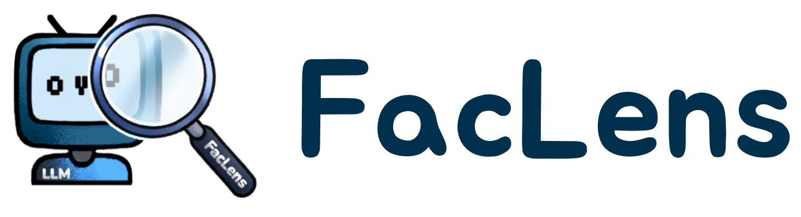

   
    
   

    <i>The source code and datasets for training, testing, and deploying FacLens.</i>

# Introduction to FacLens
FacLens (short for Factuality Lens) is a lightweight tool for non-factuality prediction of LLMs. After a user submits a question to an LLM, FacLens predicts whether the LLM knows the factual answer before the response generation.

Specifically, we explore whether we can utilize a lightweight probe to elicit "whether an LLM knows" from the hidden representations of user questions. Through extensive experimental analysis, we demonstrate that the hidden representations of questions indeed contain valuable patterns for NFP tasks, and such patterns are transferable across domains corresponding to different LLMs.

# Demo
We provide the code and checkpoints of FacLens for deploying FacLens locally. Here we show our deployed demo as follows:

**Guideline:** A user choose an LLM and enters a question in the text box.
After submitting the question, the demo returns whether the LLM knows the factual answer to the question. Afterwards, the user decides whether to call the LLM to generate the response. If the user continues to query the LLM, the demo will show the response generated by the LLM. According to the prediction of FacLens and the LLM's response, the user can score the performance of FacLens on this question.

# Overview
Specifically, the repository is structured as follows:

* `deployment/` contains **code** and **checkpoints of FacLens** for deployment. In this folder, a README file is provided to show how to deploying FacLens locally.

* `training_and_testing/` contains **code** and **datasets** for training and testing single-LLM and cross-LLM FacLens. In this folder, we also provide a README file to show how to train and test the FacLens.

* `assets/` contains the logo image and GIF format demo display.

# Requirements
Before running the code, you should install PyTorch, transformers, pandas, sklearn, numpy, and stanza.

# Show Cases
Taking the LLaMA2-Chat-7B as an example, we show some good cases as follows:

| User Question | Prediction by FacLens | LLM Response |
|----------|----------|----------|
| Who was the screenwriter for The Toy?| The LLM doesn't know. | The screenwriter for the 1982 film "The Toy" is: Tom Mankiewicz. Tom Mankiewicz was an American screenwriter and film producer. |
| Who is the director of the TV series The Happy Family?| The LLM doesn't know. | I don't have access to information about the director of the TV series "The Happy Family." The show may have been cancelled or is still in production, and I don't have access to up-to-date information about its creative team |
| Who founded KFC?| The LLM knows. | KFC, or Kentucky Fried Chicken, was founded by Colonel Harland Sanders. |
|Who is the director of the Titanic?| The LLM knows.| The director of the 1997 film "Titanic" is James Cameron.|
